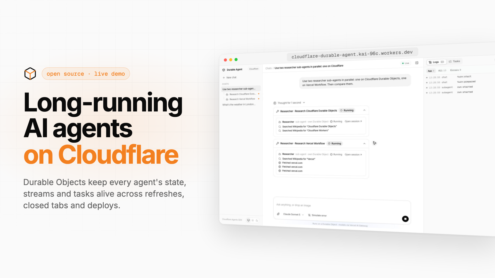
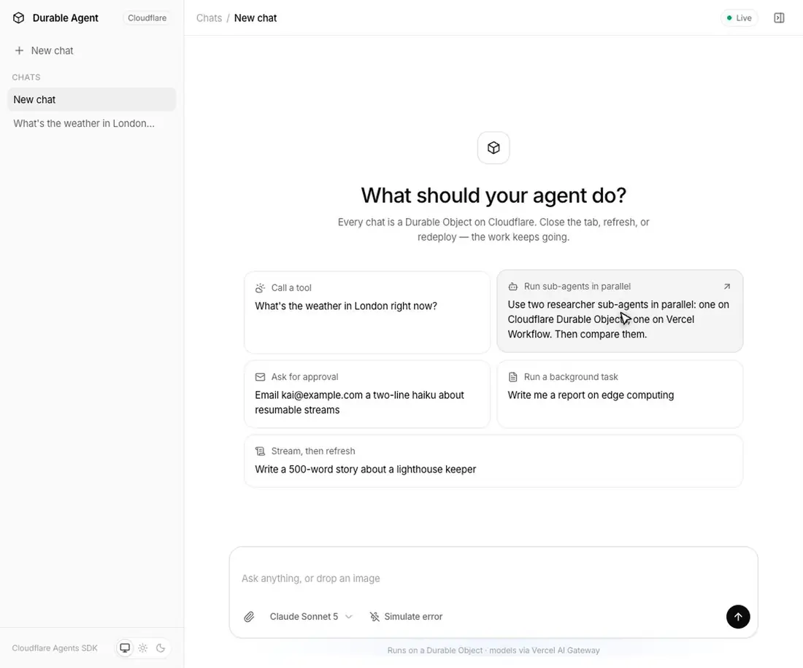
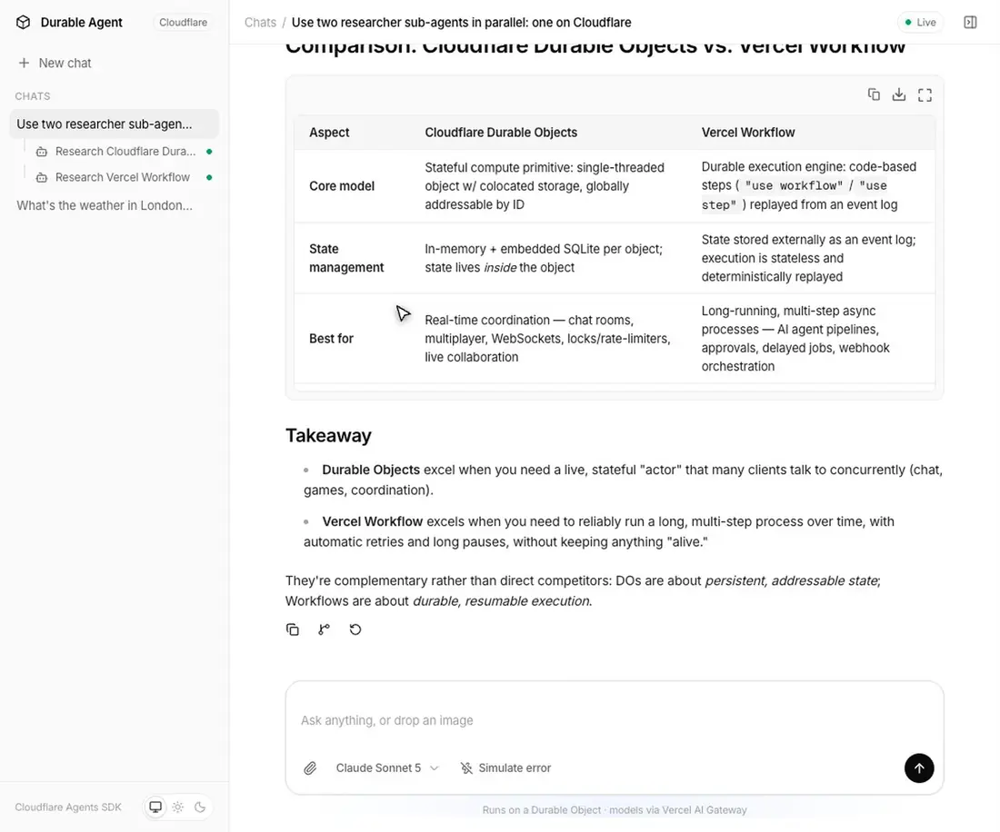
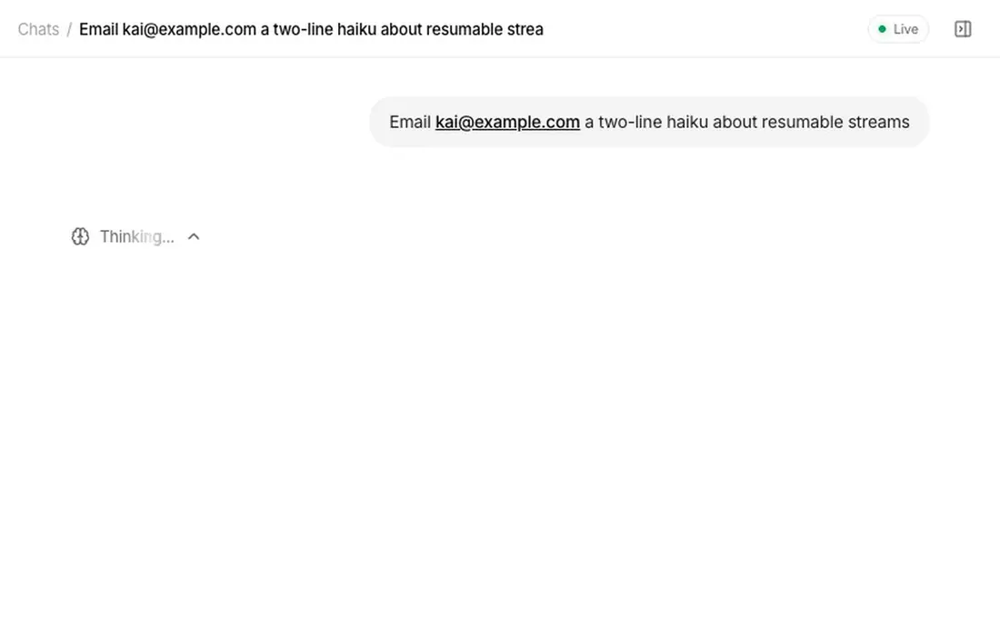
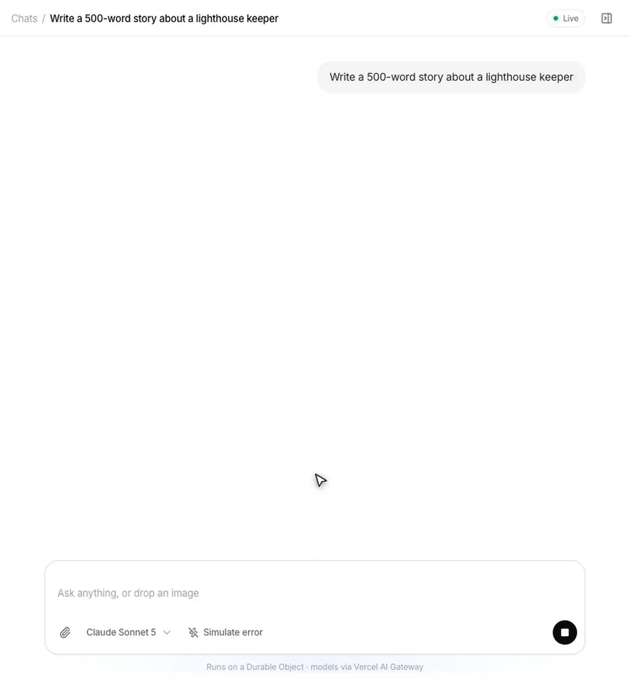
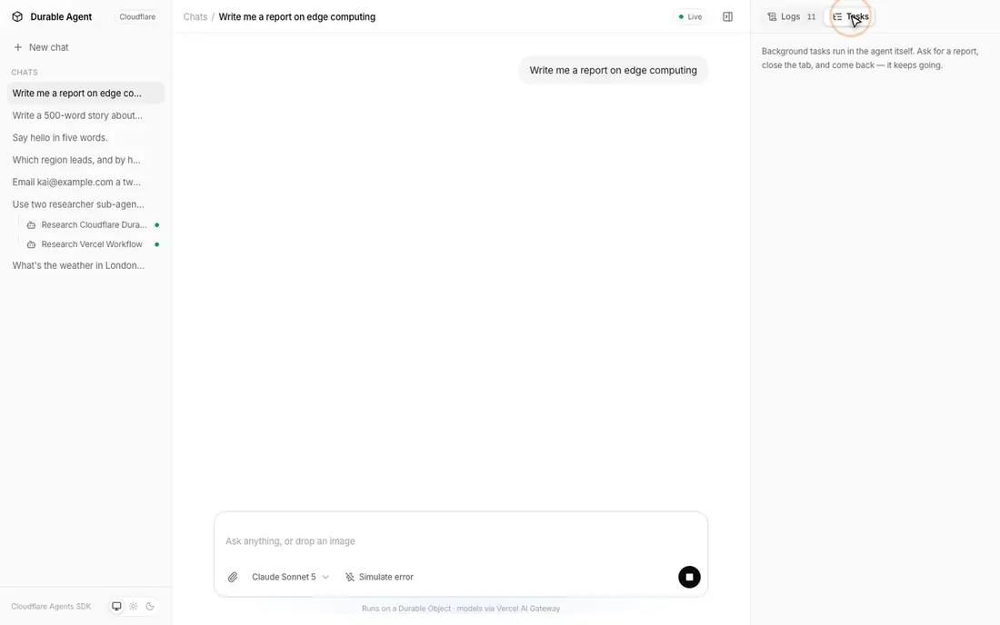
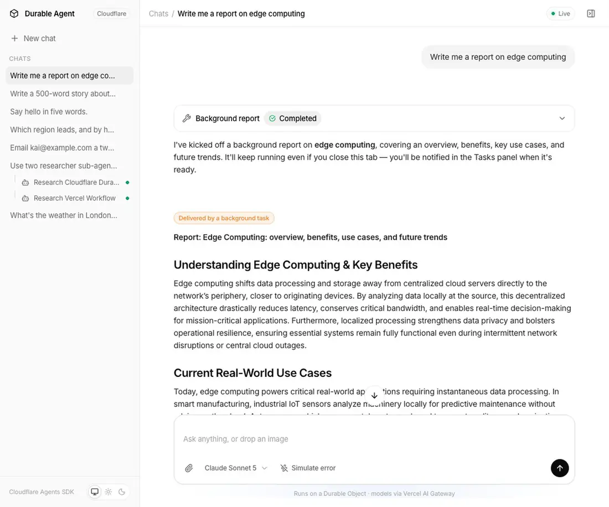
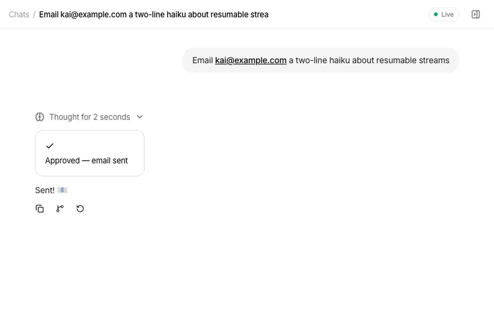
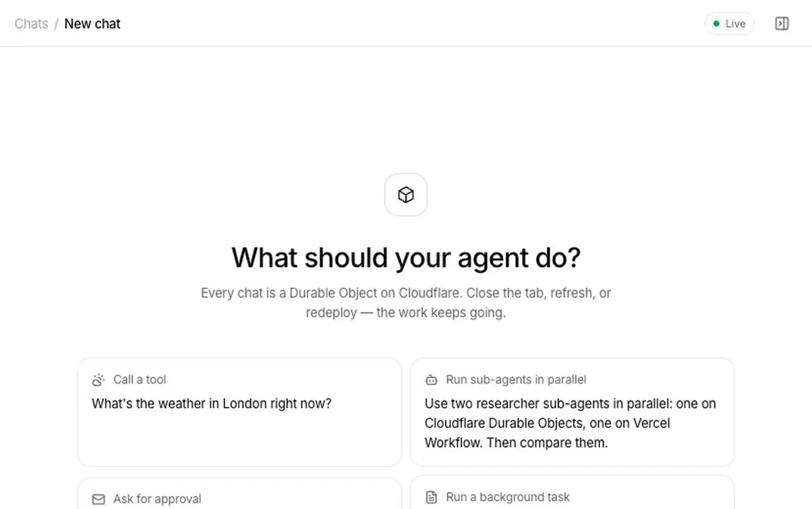
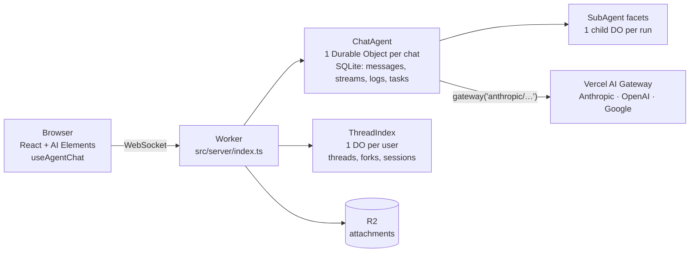

# Long-running AI agents on Cloudflare's serverless edge

**Build AI agents that work for minutes or hours on serverless Cloudflare Workers — and never lose their place — without running a server, a queue, a workflow engine or a separate database.**

A complete, tested reference app plus a step-by-step playbook. Every agent is a **Durable Object**, models run through the **Vercel AI Gateway** (`gateway()` from the AI SDK), the UI is **AI Elements**, and the whole thing deploys as **one Worker**.

**[Try the live demo →](https://cloudflare-durable-agent.kai-96c.workers.dev)** · [Watch the 1:47 video](docs/demo.mp4) · [See it work](#see-it-work)

[](docs/demo.mp4)

## The problem: agents outlive requests

Serverless edge functions are fast, cheap and global, but they are built for requests that finish in seconds. An AI agent is not a request. It makes dozens of model and tool calls, hands work to sub-agents, waits for a person to approve a step, and can run for minutes or hours. Built on plain serverless functions, it breaks in predictable ways:

- **A refresh or a dropped connection loses the answer** that was still streaming.
- **A deploy or crash mid-turn throws away the work** already done.
- **A long job must beat the function timeout**, or be moved to a separate queue and worker.
- **Waiting for a human means saving state somewhere** and wiring up a way to resume it.
- **History, stream buffers and job state each need their own store**, so one agent becomes five services.

The usual answer is to bolt on infrastructure: a database for history, Redis for resumable streams, a queue and a workflow engine for long jobs, and a long-lived server for WebSockets.

## The approach: give every agent its own durable home

A Cloudflare Durable Object is a small stateful server on Cloudflare's network: one instance per conversation, addressable by ID, with its **own SQLite database, WebSocket connections, alarms and a durable journal of steps**. It hibernates when idle, so an agent waiting on a person or a timer isn't billed for compute while it waits, and it wakes on the next message, alarm or approval. The [Cloudflare Agents SDK](https://developers.cloudflare.com/agents/) builds the agent patterns on top.

| Problem | How it is solved here |
| --- | --- |
| Stream lost on refresh | Every chunk is written to the agent's SQLite; the client resumes exactly where it was |
| Deploy or crash mid-turn | The turn runs as a durable fiber and resumes after the restart |
| Jobs longer than a request | Durable tasks: `step.do` checkpoints each step, `step.sleep` waits minutes or days, failed steps retry |
| Waiting on a human | The turn pauses at an approval; the agent hibernates until the answer arrives |
| Work that fans out | Sub-agents run as child Durable Objects, in parallel, each with its own transcript |
| State spread across services | History, streams, logs and job state all live in the agent's own SQLite |
| Operating it | One Worker, one deploy command; Cloudflare runs the rest |

## What's in the app

Each feature is checked end to end by `bun run e2e` (19 checks, real browser, real models):

| Feature | How it works here |
| --- | --- |
| **Streaming + tools** | `AIChatAgent.onChatMessage` → `streamText({ model: gateway(…) })`, tool calls rendered with AI Elements |
| **Sub-agents as real sessions** | One Claude Code–style `agent` tool launches typed sub-agents (researcher, writer, general-purpose), in parallel or in the background. Each run is a child Durable Object you can open, inspect and keep talking to |
| **Human in the loop** | `needsApproval: true` on a tool → Approve / Reject card → the turn continues |
| **Resumable streams** | Refresh mid-answer; the stream picks up where it was |
| **Crash / deploy recovery** | Chat turns run as durable fibers; a restart mid-turn resumes the turn |
| **Durable background tasks** | `taskDefinitions` with `step.do` / `step.sleep` — the Cloudflare answer to Vercel Workflow. Close the tab; the report still lands |
| **Forking** | Copy a chat up to any message into a new chat, listed as `<name> (Forked)` |
| **Image + file attachments** | Uploaded to **R2**, read by the model (images, PDFs, text) |
| **Errors + retry** | Model errors surface in the chat with a one-click Retry |
| **Live logs** | Every turn, step, tool call and SDK event, per agent, streamed to an inspector |
| **Multi-model** | Claude, GPT and Gemini through one AI Gateway key |
| **Light + dark** | System, light and dark themes |

## See it work

Recorded from this repo; each clip is sped up to fit.

**Sub-agents run in parallel**, each in its own Durable Object, and stream their tool calls into the parent chat.



**Every sub-agent is a real session.** Open it from the sidebar, read its transcript and tool calls, and keep talking to it.



**Risky actions wait for a person.** The turn pauses on an approval card and continues once you answer.



**Refresh mid-answer and the stream picks up where it was.**



**Long jobs keep running with the tab closed.** A durable task writes the report step by step and posts it when done.



**Fork any chat from any message.** The copy opens as a new chat, titled `<name> (Forked)`.



**Images and files** go to R2 and the model reads them. **Model errors** show in the chat with a one-click Retry.

<p>
  
  
</p>

## Architecture



- `src/server/chat-agent.ts` — the chat agent: tools, approvals, the `agent` tool, durable tasks, forking.
- `src/server/subagent.ts` — sub-agent types and their tools.
- `src/server/thread-index.ts` — per-user thread list, forks and sub-agent sessions.
- `src/server/files.ts` — R2 uploads and attachment inlining.
- `src/client/` — the React app (AI Elements components live in `src/components/ai-elements`).

## Run it locally

```bash
git clone https://github.com/ShadowWalker2014/cloudflare-durable-agent
cd cloudflare-durable-agent
bun install
cp .dev.vars.example .dev.vars      # add your AI_GATEWAY_API_KEY
bun run dev                          # http://localhost:5173
```

Get an AI Gateway key at [vercel.com/docs/ai-gateway](https://vercel.com/docs/ai-gateway). Durable Objects, SQLite and R2 all run locally inside `workerd` — no Cloudflare account needed for development.

## Deploy to Cloudflare

```bash
bunx wrangler login
bunx wrangler r2 bucket create durable-agent-files
bun run deploy                              # vite build + wrangler deploy
bunx wrangler secret put AI_GATEWAY_API_KEY
```

That's the whole deploy: one Worker serves the UI, the agents' WebSockets and the file API, and prints a `*.workers.dev` URL. Durable Object classes are created from the `migrations` in `wrangler.jsonc`; nothing else to provision.

**Public demos are rate-limited.** `DEMO_RATE_LIMIT` (in `wrangler.jsonc`) caps each visitor IP at 20 messages a minute and 50 every 5 hours, tracked by one small `RateLimiter` Durable Object per IP (`src/server/rate-limit.ts`). Only messages a person sends count; sub-agent runs and background tasks don't. It is off locally via `.dev.vars`. Each browser also gets its own anonymous workspace, so visitors never see each other's chats.

## Test it

```bash
bun run dev      # terminal 1
bun run e2e      # terminal 2 — 19 end-to-end checks in a real Chromium
```

## Use it as a playbook

[`skills/cloudflare-durable-agent/SKILL.md`](skills/cloudflare-durable-agent/SKILL.md) is a step-by-step guide to building any durable agent this way: the patterns above, a Vercel Workflow → Cloudflare mapping, the gotchas, and links to the official docs. Install it as a Claude Code skill:

```bash
mkdir -p ~/.claude/skills && cp -r skills/cloudflare-durable-agent ~/.claude/skills/
```

## Coming from Vercel Workflow?

| Vercel Workflow | Cloudflare (this repo) |
| --- | --- |
| `"use workflow"` function | `taskDefinitions` on the agent |
| `"use step"` | `step.do(name, fn)` |
| `sleep()` | `step.sleep(name, duration)` |
| run survives deploys | fibers + tasks persisted in the Durable Object's SQLite |
| hooks / webhooks to resume | `needsApproval`, `@callable` methods, `schedule()` |

## Versions

`agents` 0.24 · `@cloudflare/ai-chat` 0.12 · `ai` **7.0.60** (pinned — newer 7.0.x releases break approval continuations, see the skill's gotchas) · Vite 8 · React 19 · Tailwind 4.

## Docs

- Cloudflare Agents — https://developers.cloudflare.com/agents/
- Chat agents — https://developers.cloudflare.com/agents/api-reference/chat-agents/
- Sub-agents and agent tools — https://developers.cloudflare.com/agents/api-reference/sub-agents/
- Human in the loop — https://developers.cloudflare.com/agents/concepts/human-in-the-loop/
- Durable Objects — https://developers.cloudflare.com/durable-objects/
- AI SDK — https://ai-sdk.dev · AI Gateway provider — https://ai-sdk.dev/providers/ai-sdk-providers/ai-gateway
- AI Elements — https://ai-sdk.dev/elements

## License

MIT
