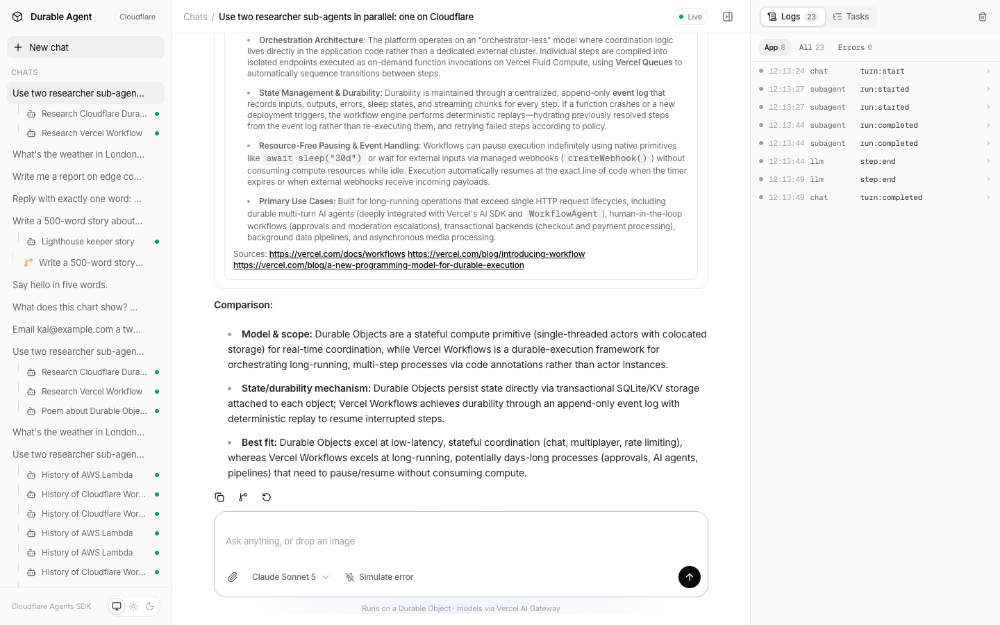
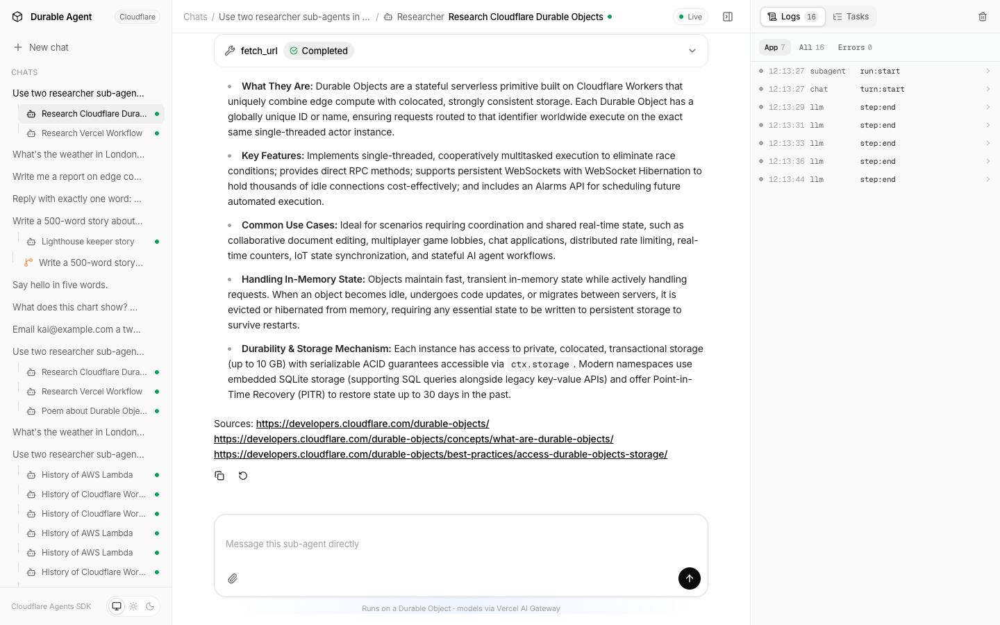
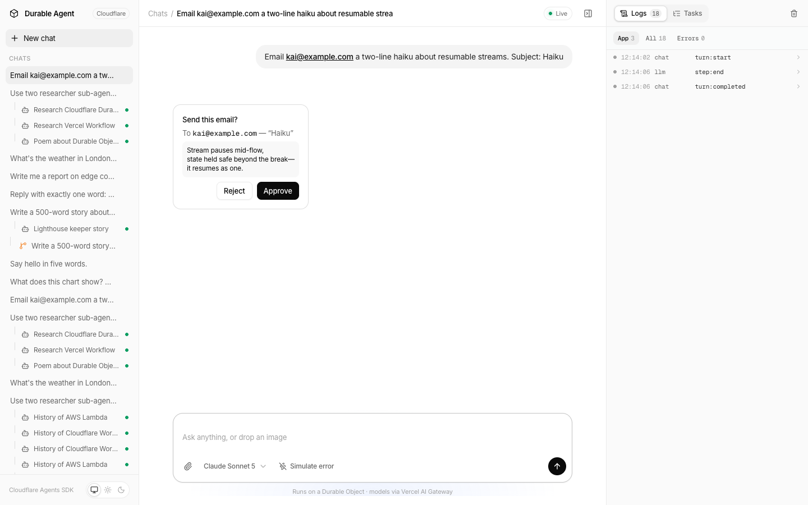
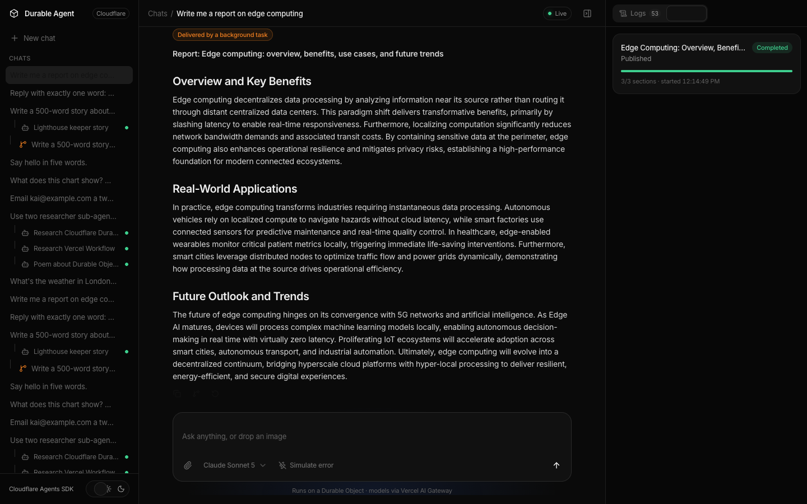
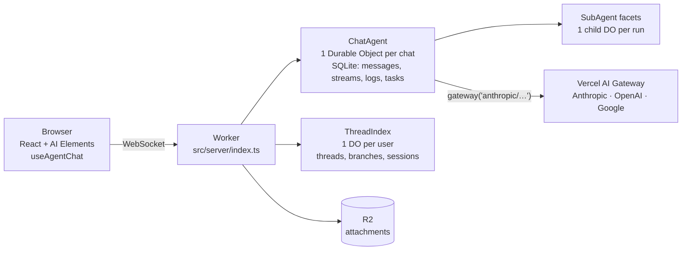

# Durable AI agents on Cloudflare — Agents SDK + Durable Objects + Vercel AI Gateway

A complete, working reference for building **durable AI agents on Cloudflare Workers**: a chat agent that keeps working when you refresh, close the tab or redeploy. Every conversation is its own **Durable Object**; models run through the **Vercel AI Gateway** (`gateway()` from the AI SDK); the UI is built with **AI Elements**. The whole app deploys as **one Worker**.

[](docs/demo.mp4)

▶ **[Watch the demo (1:42)](docs/demo.mp4)**, recorded from this repo running locally.

It covers the cases every real agent needs, each one checked end to end by `bun run e2e` (19 checks, real browser, real models):

| Feature | How it works here |
| --- | --- |
| **Streaming + tools** | `AIChatAgent.onChatMessage` → `streamText({ model: gateway(…) })`, tool calls rendered with AI Elements |
| **Sub-agents as real sessions** | One Claude Code–style `agent` tool launches typed sub-agents (researcher, writer, general-purpose), in parallel or in the background. Each run is a child Durable Object you can open, inspect and keep talking to |
| **Human in the loop** | `needsApproval: true` on a tool → Approve / Reject card → the turn continues |
| **Resumable streams** | Refresh mid-answer; the stream picks up where it was |
| **Crash / deploy recovery** | Chat turns run as durable fibers; a restart mid-turn resumes the turn |
| **Durable background tasks** | `taskDefinitions` with `step.do` / `step.sleep` — the Cloudflare answer to Vercel Workflow. Close the tab; the report still lands |
| **Branching** | Copy a thread up to any message into a new thread |
| **Image + file attachments** | Uploaded to **R2**, read by the model (images, PDFs, text) |
| **Errors + retry** | Model errors surface in the chat with a one-click Retry |
| **Live logs** | Every turn, step, tool call and SDK event, per agent, streamed to an inspector |
| **Multi-model** | Claude, GPT and Gemini through one AI Gateway key |
| **Light + dark** | System, light and dark themes |

<p>
  
  
  
  
</p>

## Architecture



- `src/server/chat-agent.ts` — the chat agent: tools, approvals, the `agent` tool, durable tasks, branching.
- `src/server/subagent.ts` — sub-agent types and their tools.
- `src/server/thread-index.ts` — per-user thread list, branch tree and sub-agent sessions.
- `src/server/files.ts` — R2 uploads and attachment inlining.
- `src/client/` — the React app (AI Elements components live in `src/components/ai-elements`).

## Run it locally

```bash
git clone https://github.com/ShadowWalker2014/cloudflare-durable-agent
cd cloudflare-durable-agent
bun install
cp .dev.vars.example .dev.vars      # add your AI_GATEWAY_API_KEY
bun run dev                          # http://localhost:5173
```

Get an AI Gateway key at [vercel.com/docs/ai-gateway](https://vercel.com/docs/ai-gateway). Durable Objects, SQLite and R2 all run locally inside `workerd` — no Cloudflare account needed for development.

## Deploy to Cloudflare

```bash
bunx wrangler r2 bucket create durable-agent-files
bunx wrangler secret put AI_GATEWAY_API_KEY
bun run deploy
```

That's the whole deploy: one Worker serves the UI, the agents' WebSockets and the file API.

## Test it

```bash
bun run dev      # terminal 1
bun run e2e      # terminal 2 — 19 end-to-end checks in a real Chromium
```

## Use it as a playbook

[`skills/cloudflare-durable-agent/SKILL.md`](skills/cloudflare-durable-agent/SKILL.md) is a step-by-step guide to building any durable agent this way: the patterns above, a Vercel Workflow → Cloudflare mapping, the gotchas, and links to the official docs. Install it as a Claude Code skill:

```bash
mkdir -p ~/.claude/skills && cp -r skills/cloudflare-durable-agent ~/.claude/skills/
```

## Coming from Vercel Workflow?

| Vercel Workflow | Cloudflare (this repo) |
| --- | --- |
| `"use workflow"` function | `taskDefinitions` on the agent |
| `"use step"` | `step.do(name, fn)` |
| `sleep()` | `step.sleep(name, duration)` |
| run survives deploys | fibers + tasks persisted in the Durable Object's SQLite |
| hooks / webhooks to resume | `needsApproval`, `@callable` methods, `schedule()` |

## Versions

`agents` 0.24 · `@cloudflare/ai-chat` 0.12 · `ai` **7.0.60** (pinned — newer 7.0.x releases break approval continuations, see the skill's gotchas) · Vite 8 · React 19 · Tailwind 4.

## Docs

- Cloudflare Agents — https://developers.cloudflare.com/agents/
- Chat agents — https://developers.cloudflare.com/agents/api-reference/chat-agents/
- Sub-agents and agent tools — https://developers.cloudflare.com/agents/api-reference/sub-agents/
- Human in the loop — https://developers.cloudflare.com/agents/concepts/human-in-the-loop/
- Durable Objects — https://developers.cloudflare.com/durable-objects/
- AI SDK — https://ai-sdk.dev · AI Gateway provider — https://ai-sdk.dev/providers/ai-sdk-providers/ai-gateway
- AI Elements — https://ai-sdk.dev/elements

## License

MIT
